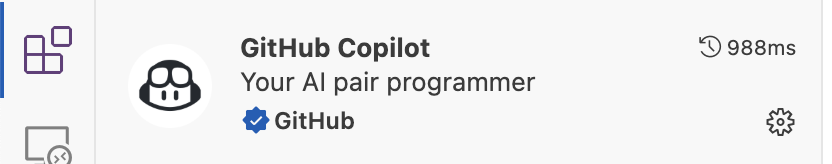
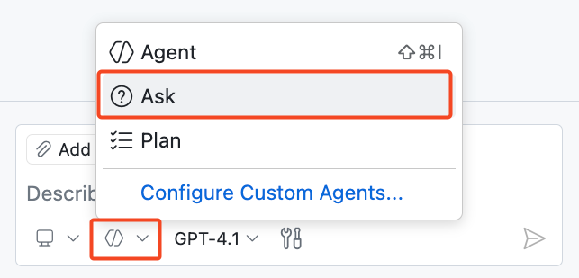
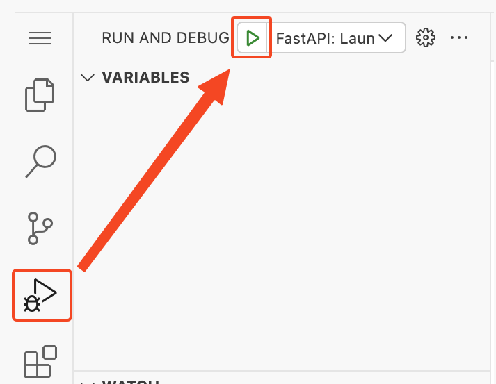
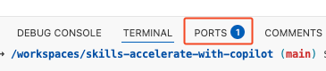

## 步骤 1: Hello Copilot

欢迎来到 **“GitHub Copilot 入门”** 课程! :robot:

在本课程中，你将和 GitHub Copilot 一起动手参与一个真实项目 —— 帮助优化 Mergington 高中的学生课外活动报名网站。🎻 ⚽️ ♟️

  

### 📖 快速了解 GitHub Copilot


GitHub Copilot 是一款 AI 编程助手，可以帮助你更快、更高效地编写代码，让你能把精力集中在问题分析和协作上。

研究证明，GitHub Copilot 能显著提升开发效率，加快软件开发节奏。
如果你感兴趣可查看 [GitHub 博客：量化 Copilot 对开发者效率与幸福感的影响](https://github.blog/news-insights/research/research-quantifying-github-copilots-impact-on-developer-productivity-and-happiness/)。

在 IDE 中使用 Copilot 常见的几种方式：

| 交互模式                           | 📝 功能说明                                                    | 🎯 适用场景             |
|--------------------------------| ------------------------------------------------------------- | ------------------- |
| **⚡ 行内建议（Inline Suggestions）** | 在你输入代码时自动弹出补全建议，从一行代码到整段函数都可能帮你生成。 | 快速补全代码、减少重复输入    |
| **💬 行内对话（Inline Chat）**       | 针对当前文件或选中代码进行提问和交流。                            | 理解代码、调试函数、局部优化    |
| **💬 提问模式（Ask Mode）**          | 用于回答关于代码、项目结构或技术概念的问题。              | 学习原理、理清思路、提问解惑    |
| **🤖 智能体模式（Agent Mode）**       | 默认推荐模式，可以自动修改代码并持续执行任务直到完成。               | 日常开发任务，从小修改到多文件改动 |
| **🧭 规划模式（Plan Agent）**       | 先帮你制定方案、再执行代码修改。                     | 需要先评估方案再动手的场景      |

在实际使用中，Copilot 不仅可以在 `github.com` 网站上发挥作用，也可以集成在你常用的开发工具中，比如 VS Code、JetBrains 系列 IDE 和 Xcode 等。

本次课程我们将在基于 VS Code 的云端开发环境 —— [GitHub Codespace](https://github.com/features/codespaces) 中进行。

> [!TIP]
> 想了解更多功能？请参考 [GitHub Copilot 功能文档](https://docs.github.com/en/copilot/about-github-copilot/github-copilot-features)

### :keyboard: 实操环节: 使用 Copilot 快速了解项目

接下来，我们将启动开发环境，通过 Copilot 帮助理解当前项目概况，并运行项目。

1. 点击下方按钮，在新标签页中打开 **Create Codespace** 页面，保持默认配置。

   [](https://codespaces.new/{{full_repo_name}}?quickstart=1)

2. 确认 **Repository** 显示的是你自己练习的仓库，而不是原始仓库，然后点击绿色的 **Create Codespace** 按钮。
   - ✅ 你的: `/{{full_repo_name}}`
   - ❌ 原始: `/skills/getting-started-with-github-copilot`

3. 等待 VS Code 在浏览器中加载完成。

4. 打开左边栏的扩展（Extensions）菜单，确认 `GitHub Copilot` 和 `Python` 插件均已安装并启用。

   

   

5. 点击 VS Code 顶部的 **Toggle Chat 图标**，打开 Copilot 聊天侧边栏。

   

   > 🪧 **Note:** If this is your first time using GitHub Copilot, you will need to accept the usage terms to continue.

6. 将模式切换为 **Ask Mode（提问模式）**。

   

7. 输入以下提示词，让 Copilot 介绍项目

   > 
   >
   > ```prompt
   > 请简单介绍一下这个项目的结构。
   > 我应该如何运行它？
   > ```

   > 🪧 **注意:**：Copilot 给出的运行步骤仅供参考，本练习环境已经帮你配置好了。

8. 了解完项目后，让我们实际运行一下！点击左侧边栏的 **Run and Debug** 菜单，然后按下 **Start Debugging** 图标。

   

9. 为了在浏览器中查看网页，我们需要找到访问地址和端口。在底部面板中找到 **Ports** tab页。 找到端口号 `8000`，将鼠标悬停在其链接上，点击 **Open in browser（在浏览器中打开）**。

   

### :keyboard: 实操环节: 使用 Copilot 执行 git 命令 🙋

网站已成功运行起来了。接下来我们借助 Copilot 来完成一个常见操作：创建并发布一个新分支。

1. 在 VS Code 底部面板中，切换到 **Terminal** 标签页，然后点击右上角的 “+” 号，打开一个新终端窗口。
2. 在新终端中，按下快捷键 `Ctrl + I`（Windows）或 `Cmd + I`（Mac），调出 **Copilot 的终端内联聊天窗口**。
3. 假设我们需要新建一个分支并把它推送到到远程仓库，但我们忘记了命令，我们可以这样对Copilot说：

   > 
   >
   > ```prompt
   > Hey copilot, how can I create and publish a new Git branch called "accelerate-with-copilot"?
   > ```

   > 💡 **提示:** 如果回答不完全符合你的需求，可以继续补充说明，Copilot 会结合上下文继续回答

4. 然后点击 `Run` 按钮，Copilot 会直接执行命令，无需手动复制粘贴。

5. 稍等片刻后查看 VS Code 左下角状态栏，当前分支应显示为 `accelerate-with-copilot`。若已切换成功，说明你完成了此步骤！

6. 分支推送到 GitHub 后，Mona 会自动开始检查你的任务。稍等片刻，她会在评论中回复进度与下一步任务。

<details>
<summary>遇到问题? 🤷</summary><br/>

若未收到反馈，请检查以下事项：

- 确认分支名称是否为 `accelerate-with-copilot`。
- 确认分支是否成功推送到你的仓库中。

</details>
