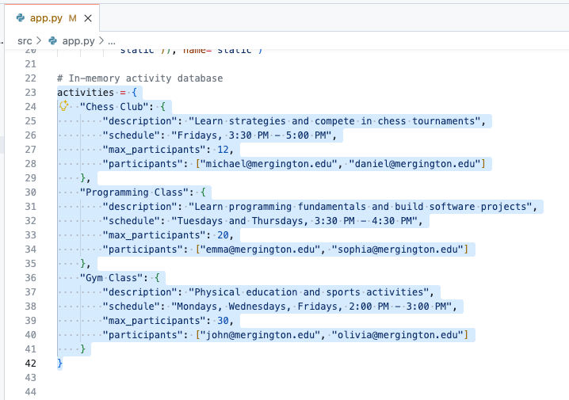
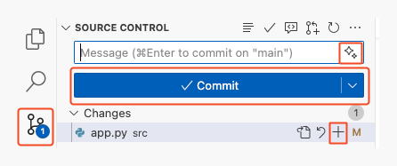

## 步骤 2: 借助 Copilot 快速完成任务

在上一步中，GitHub Copilot 已经帮助我们快速熟悉了项目，这本身就节省了不少时间。接下来，我们来真正解决一个实际问题！

:bug: **糟糕，网站上出现了一个 BUG** :bug:

我们发现报名流程有点问题：学生竟然可以重复报名同一个活动！😱
考验 Copilot 的时候到了，看它能否帮助我们找出问题来源并修复。

在开始之前，先简单了解一下 Copilot 的工作方式。🧑‍🚀

### 📖 Copilot 是如何工作的

可以把 Copilot 想象成一位“专业但需要引导的同事”。要让它发挥最大价值，你需要给它两样东西：**上下文** 和 **清晰的指令**。另外，不同模型就像不同背景的工程师，各有所长。

* **如何提供上下文?:** 在 IDE 中，Copilot 会自动参考当前文件、附近代码以及已打开的标签页。如果使用聊天功能，你也可以手动指定文件。
* **选择模型：** 本次练习中选哪个模型不是我们关注的焦点，可以自行尝试，体会不同模型的特点与效果。🤖
* **如何写提示词（prompt）：** 指令要清楚明确，这样 Copilot 才能给出最贴切的结果；当然，你也可以随时补充说明，它能理解上下文继续帮你完善。

> [!TIP]
> 你还可以通过 [聊天参与者](https://docs.github.com/en/copilot/using-github-copilot/copilot-chat/github-copilot-chat-cheat-sheet?tool=vscode#chat-participants)、[聊天变量](https://docs.github.com/en/copilot/using-github-copilot/copilot-chat/github-copilot-chat-cheat-sheet?tool=vscode#chat-variables)、[斜杠命令](https://docs.github.com/en/copilot/using-github-copilot/copilot-chat/github-copilot-chat-cheat-sheet?tool=vscode#slash-commands-1) 和 [MCP 工具](https://code.visualstudio.com/docs/copilot/chat/mcp-servers) 等方式进一步增强 Copilot 的能力。

### :keyboard: 实操环节: 使用 Copilot 修复 bug :bug:

1. 首先让 Copilot 帮我们分析 Bug 可能出在哪里。打开 **Copilot Chat 面板**，选择 **Ask 模式**，然后输入：

   > 
   >
   > ```prompt
   > #codebase Students are able to register twice for an activity.
   > Where could this bug be coming from?
   > ```

1. 根据 Copilot 的提示，我们知道问题出现在 `src/app.py` 文件中的 `signup_for_activity` 方法。接下来我们手动配合 Copilot 来修复这个问题。

   1. 找到并打开 `src/app.py` 文件。

      > 💡 **提示**: 如果 Copilot 在聊天中提及了该文件，可以直接点击打开

   2. 滚动到文件底部附近，找到 `signup_for_activity` 方法。

   3. 找到那条 “Add student” 的注释，在它上方添加注册校验逻辑。

   4. 输入下面这行注释后按下回车，稍等片刻，你会看到 Copilot 自动出现代码建议：

      ```python
      # Validate student is not already signed up
      ```

      

   1. 按下 `Tab` 键接受建议，生成代码。

   <details>
   <summary>参考示例代码</summary><br/>

   注意：Copilot 每天都在不断进步，因此生成的结果可能会有所不同。
   如果你对当前的建议不太满意，可以参考我们给出的示例结果，用它来继续完成后续步骤。

   ```python
   @app.post("/activities/{activity_name}/signup")
   def signup_for_activity(activity_name: str, email: str):
      """Sign up a student for an activity"""
      # Validate activity exists
      if activity_name not in activities:
         raise HTTPException(status_code=404, detail="Activity not found")

      # Get the activity
      activity = activities[activity_name]

      # Validate student is not already signed up
      if email in activity["participants"]:
        raise HTTPException(status_code=400, detail="Student is already signed up")

      # Add student
      activity["participants"].append(email)
      return {"message": f"Signed up {email} for {activity_name}"}
   ```

   </details>

### :keyboard: 实操环节: 让 Copilot 生成测试数据 📋

开发阶段，经常需要生成用于测试的模拟数据。Copilot 在这方面非常强！
这里我们也顺便体验另一种交互方式：Inline Chat（行内对话）

👉 区别说明：

Copilot Chat：适合跨文件、全局问题
Inline Chat：适合针对当前代码块的快速修改

1. 打开 `src/app.py` 文件，在顶部（大约第 23 行）找到 activities 变量
1. 选中整个 `activities` 字典，这样可以为 Copilot 提供更充分的上下文信息。
   
   

1. 使用快捷键打开行内对话，Windows：Ctrl + I，Mac：Cmd + I

   > 💡 **提示:** 或者右键选择“Open Inline Chat”

1. 输入提示词，并发送： 

   > 
   >
   > ```prompt
   > Add 2 more sports related activities, 2 more artistic
   > activities, and 2 more intellectual activities.
   > ```

1. Copilot 会直接修改代码，并用高亮标出变更内容，检查无误后点击 **Keep** 保留修改

   <details>
   <summary>示例结果</summary><br/>

   如果你对当前的建议不太满意，可参考下面的完整样例

   ```python
   # In-memory activity database
   activities = {
      "Chess Club": {
         "description": "Learn strategies and compete in chess tournaments",
         "schedule": "Fridays, 3:30 PM - 5:00 PM",
         "max_participants": 12,
         "participants": ["michael@mergington.edu", "daniel@mergington.edu"]
      },
      "Programming Class": {
         "description": "Learn programming fundamentals and build software projects",
         "schedule": "Tuesdays and Thursdays, 3:30 PM - 4:30 PM",
         "max_participants": 20,
         "participants": ["emma@mergington.edu", "sophia@mergington.edu"]
      },
      "Gym Class": {
         "description": "Physical education and sports activities",
         "schedule": "Mondays, Wednesdays, Fridays, 2:00 PM - 3:00 PM",
         "max_participants": 30,
         "participants": ["john@mergington.edu", "olivia@mergington.edu"]
      },
      "Basketball Team": {
         "description": "Competitive basketball training and games",
         "schedule": "Tuesdays and Thursdays, 4:00 PM - 6:00 PM",
         "max_participants": 15,
         "participants": []
      },
      "Swimming Club": {
         "description": "Swimming training and water sports",
         "schedule": "Mondays and Wednesdays, 3:30 PM - 5:00 PM",
         "max_participants": 20,
         "participants": []
      },
      "Art Studio": {
         "description": "Express creativity through painting and drawing",
         "schedule": "Wednesdays, 3:30 PM - 5:00 PM",
         "max_participants": 15,
         "participants": []
      },
      "Drama Club": {
         "description": "Theater arts and performance training",
         "schedule": "Tuesdays, 4:00 PM - 6:00 PM",
         "max_participants": 25,
         "participants": []
      },
      "Debate Team": {
         "description": "Learn public speaking and argumentation skills",
         "schedule": "Thursdays, 3:30 PM - 5:00 PM",
         "max_participants": 16,
         "participants": []
      },
      "Science Club": {
         "description": "Hands-on experiments and scientific exploration",
         "schedule": "Fridays, 3:30 PM - 5:00 PM",
         "max_participants": 20,
         "participants": []
      }
   }
   ```

   </details>

1. 现在你可以回到网页中，确认刚刚新增的活动是否已经显示出来。

### :keyboard: 实操环节: 用 Copilot 自动生成提交说明 💬

很好！你已经完成了 Bug 修复和数据扩展，接下来把修改提交到 GitHub。

1. 打开左侧 **Source Control（源代码管理）** 面板
   >  💡 **Tip:** 从这里打开文件可以直接看到改动差异

1. 找到 `app.py`，点击 `+` 将修改加入暂存区

   

1. 不要手动输入提交信息，而是点击消息框右边的 ✨ **Generate Commit Message** 按钮，让 Copilot 自动生成说明。

1. 点击 **Commit** 按钮提交，然后点击 **Sync Changes** 推送到 GitHub。

1. 稍等片刻，Mona 会自动检查你的提交并给出反馈和下一步任务

<details>
<summary>遇到问题? 🤷</summary><br/>

如果没有收到反馈，请确认:

- 是否将 `src/app.py` 文件的修改推送到了 `accelerate-with-copilot` 分支。

</details>
