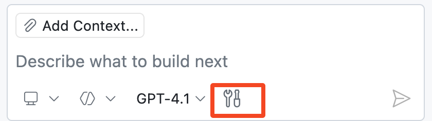

## 步骤 3: 智能体模式 🚀

### 📖 理论: 什么是 Copilot Agent Mode?

Copilot [agent mode（智能体模式）](https://code.visualstudio.com/docs/copilot/chat/chat-agent-mode) 可以看作是 AI 编程能力的一次“进化升级”。在这个模式下，它更像一位能够独立完成任务的“协作开发者”，可以根据你的指令自动拆解问题，并一步步完成复杂的开发工作。

它不仅能写代码，还能

* 响应编译和代码检查（lint）错误
* 监控终端输出和测试结果
* 自动循环修正问题，直到任务完成

#### Agent Mode 一览

| 方面       | 👩‍🚀 Agent Mode 表现                 |
| -------- | ----------------------------------- |
| 自主性与规划能力 | 能将高层需求拆解为多个步骤，并持续迭代直至完成             |
| 上下文获取    | 利用当前代码环境，并在需要时自动查找相关文件              |
| 工具调用     | 自动选择并使用工具，也支持通过 `#codebase` 等方式手动指定 |
| 安全与控制    | 涉及敏感操作时会请求确认，确保你始终掌控过程              |

#### 🧰 Agent Mode Tools

Agent Mode 会借助各种“工具”来完成任务，例如：

- 查找与你需求相关的代码文件
- 获取网页内容
- 执行测试或终端命令

> [!TIP]
> 除了 VS Code 内置工具，你还可以通过 **MCP 工具**扩展 Agent Mode 的能力，使其更贴合特定业务场景。
>
> 更多请阅读 [MCP servers](https://code.visualstudio.com/docs/copilot/customization/mcp-servers) 和 [GitHub MCP Server](https://github.com/github/github-mcp-server)

下面我们来具体试试吧! 👩‍🚀

### :keyboard: 实操环节: 用 Copilot 添加新功能! :rocket:

当前网站虽然展示了活动列表，但报名的学生名单却是“隐藏”的 🤫 

我们来让 Copilot 帮我们把每个活动的报名人员显示出来！

1. 在 Copilot Chat 窗口底部，将模式切换为 **Agent** Mode

   

1. 打开以下与网页相关的文件，并拖入聊天窗口作为上下文：

   - `src/static/app.js`
   - `src/static/index.html`
   - `src/static/styles.css`

   > 🪧 **注意:** 添加文件上下文不是必须的，如果你跳过这一步，Copilot 的 Agent Mode 仍然可以通过 `#codebase` 等工具自动搜索相关文件。不过，手动指定相关文件可以帮助 Copilot 更准确理解你的意图（尤其在大型项目中非常有用）

   

   > 💡 **提示:** 也可以通过 **Add Context...** 添加其他类型的上下文，例如 GitHub Issue 或终端输出。

1. 输入提示词，让 Copilot 显示活动的当前参与者。稍等片刻，Copilot 会自动生成并应用修改建议。

   > 
   >
   > ```prompt
   > Hey Copilot, can you please edit the activity cards to add a participants section.
   > It will show what participants that are already signed up for that activity as a bulleted list.
   > Remember to make it pretty!
   > ```

   Copilot 完成后，你可以选择是否保留这些修改： 

   使用 **Keep** 按钮接受，或逐条查看后再决定是否保留

      


1. 在确认修改前，请先运行网站进行验证： 

   查看活动卡片是否显示了报名人员。必要时刷新页面或重启应用

   

   > 🪧 **注意:** 不同人生成的界面可能略有差异，这是正常的

   <details>
   <summary>需要帮助? 🤷</summary><br/>
   如果网站无法加载，请检查以下几点：

   - 重启 VS Code 调试器，以确保加载的是网站的最新版本。
   - 如果您忘记了网址或已关闭窗口，请回顾第 1 步。
   - 尝试“强制刷新”网页，或在“隐私窗口”中打开，以防缓存问题。

   </details>

1. 确认无误后，点击 **Keep** 应用修改

   > 💡 **提示:** 您可以在聊天界面直接接受更改、对其进行修改，或提供进一步的指令以进行完善。

### :keyboard: 实操环节: 添加“取消报名”按钮

接下来我们做一个更开放的功能扩展：允许用户取消报名。

如果结果不理想，您可以尝试其他模型或继续提问以改进结果。

1. 确认当前仍处于 **Agent** mode.

   

1. 点击 **Tools** 图标，查看 Copilot 当前可用工具

   

1. 输入提示词，让 Copilot 添加“删除参与者”的功能。

   > 
   >
   > ```prompt
   > #codebase Please add a delete icon next to each participant and hide the bullet points.
   > When clicked, it will unregister that participant from the activity.
   > ```

   这里的 `#codebase` 工具用于让 Copilot 自动查找相关代码文件

   > 🪧 **注意:** 本实验中我们刻意加入 `#codebase`，是为了让结果更稳定、便于重复验证。
   > 你可以尝试去掉 `#codebase` 再执行一次，看看 Agent Mode 是否会主动分析整个项目并获取更广泛的上下文信息。

1. 等待 Copilot 完成修改后，检查代码变更并在网页中验证功能是否正常。如果满意，点击 **Keep**，否则可以继续让 Copilot 调整

   > 🪧 **注意:** 如果网页没有更新，可能需要重启下。

1. 接下来，我们再让 Copilot 修复注册 Bug。

   > 💡 **提示:** 我们建议您亲自测试注册流程，以便清晰地观察变更前后的行为差异。

   > 
   >
   > ```prompt
   > I've noticed there seems to be a bug.
   > When a participant is registered, the page must be refreshed to see the change on the activity.
   > ```

1. 等 Copilot 修改完成后，再次测试报名流程。

   满意点击 **Keep** 按钮，否则继续反馈修改。

1. 完成后，将所有修改 **Commit** 并 **push** 到 `accelerate-with-copilot` 分支。

1. 稍等片刻，Mona 会自动检查你的代码并给出下一步指引